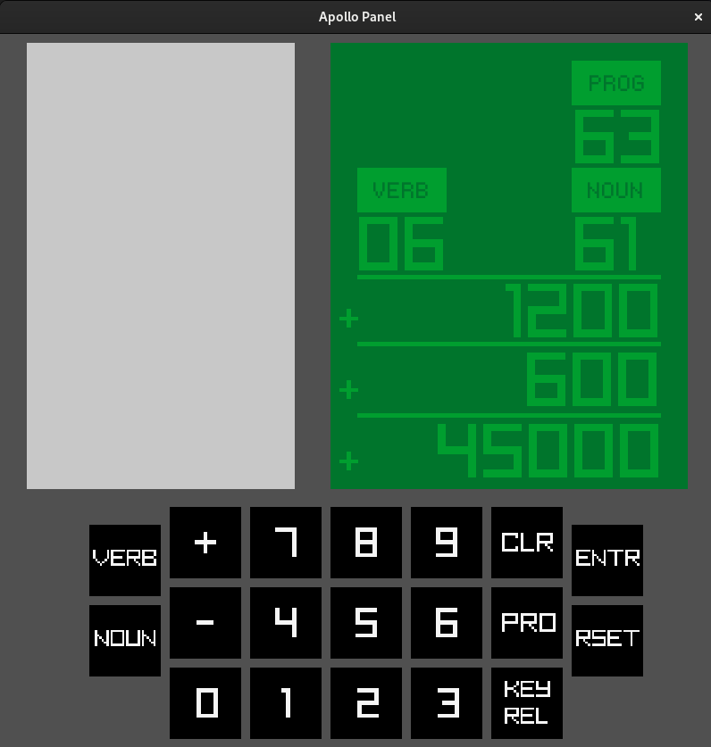

# Apollo Panel

Inspired by the YouTube video Light Years Ahead - The 1969 Apollo Guidance Computer:  
https://www.youtube.com/watch?v=B1J2RMorJXM  
20:58

To compile:
```
gcc -o apollopanel panel.c -lraylib -lGL -lm -lpthread -lrt -lX11
```


Links that helped: 
https://www.raylib.com/cheatsheet/cheatsheet.html

  

